<!-- ===== BANNER ANIMADO (lo genera scripts/generate_svgs.py) ===== -->

<!-- ===== ESTADÍSTICAS ===== -->

<!-- Racha — ancho completo -->

 

<!-- Estadísticas + lenguajes — lado a lado (los genera .github/workflows/profile.yml) -->

<!-- ===== SERPIENTE DE CONTRIBUCIONES ===== -->

<!-- ===== PROYECTOS ===== -->

 
 

<!-- ===== REDES ===== -->

 

&nbsp;&nbsp;

&nbsp;&nbsp;

